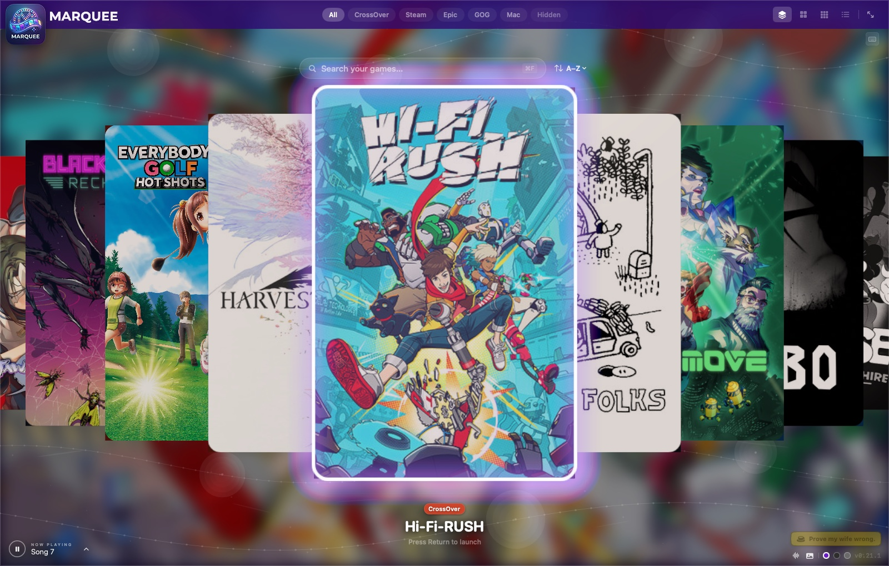
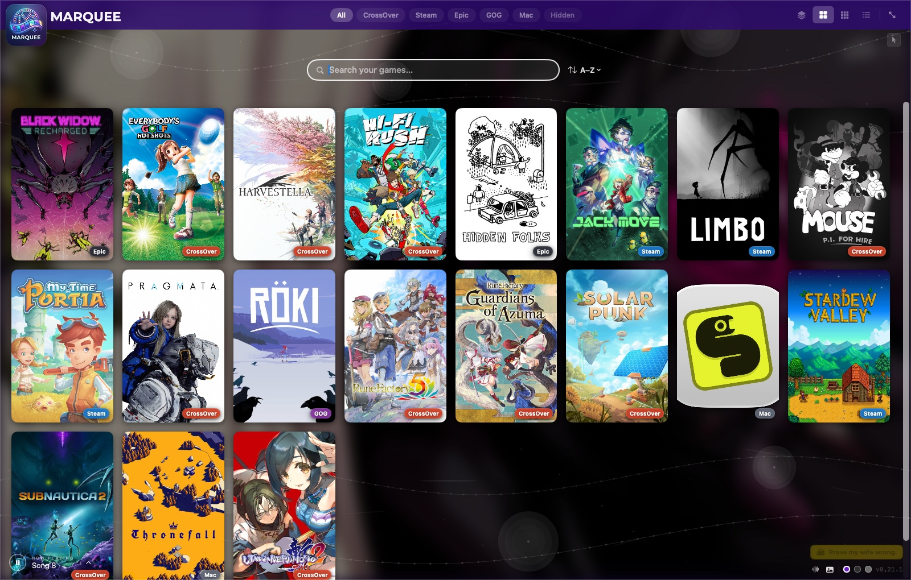
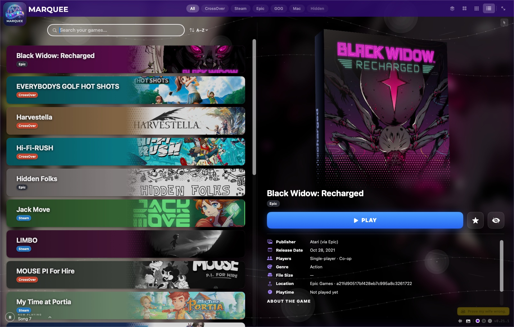
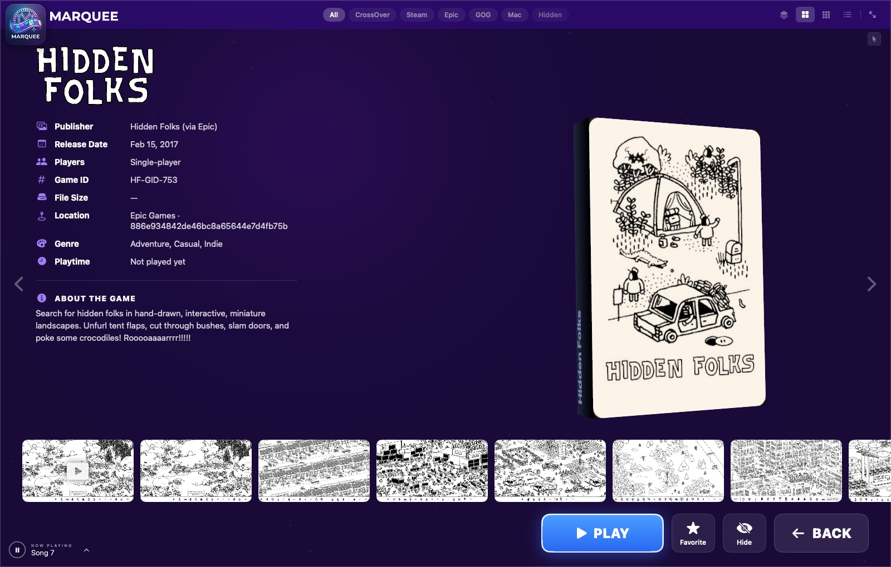
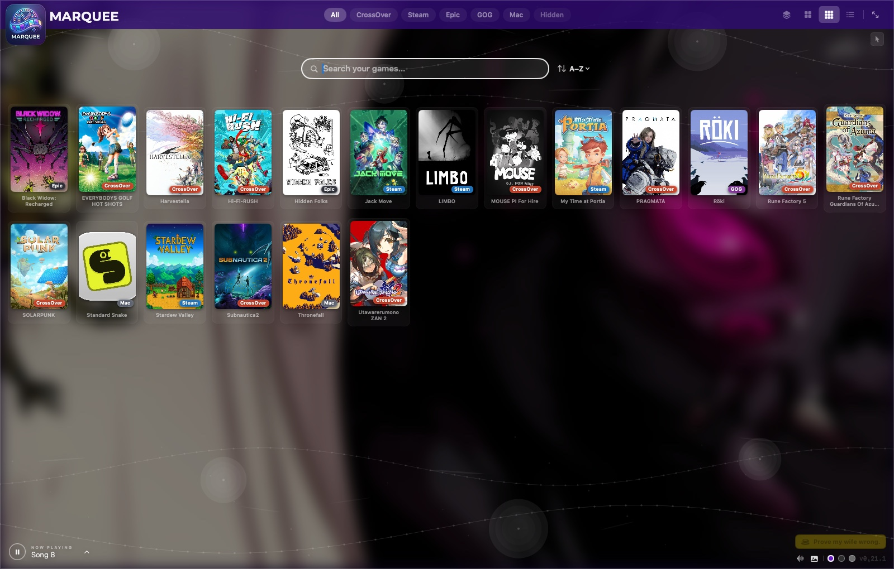
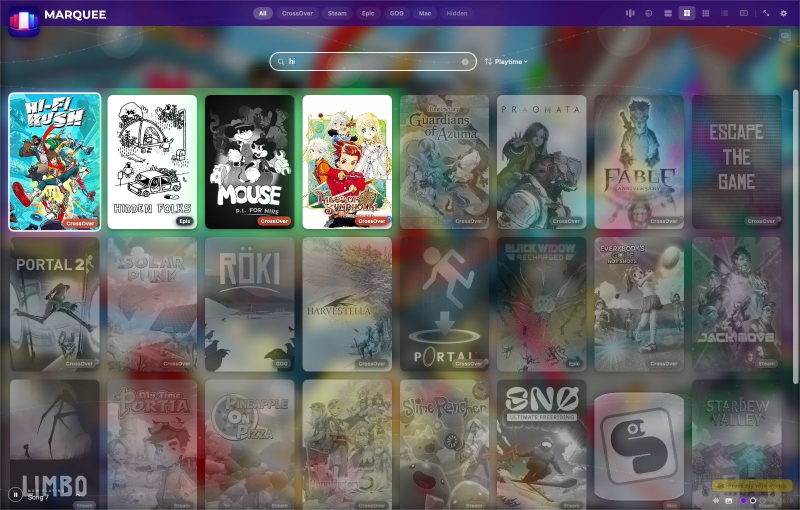
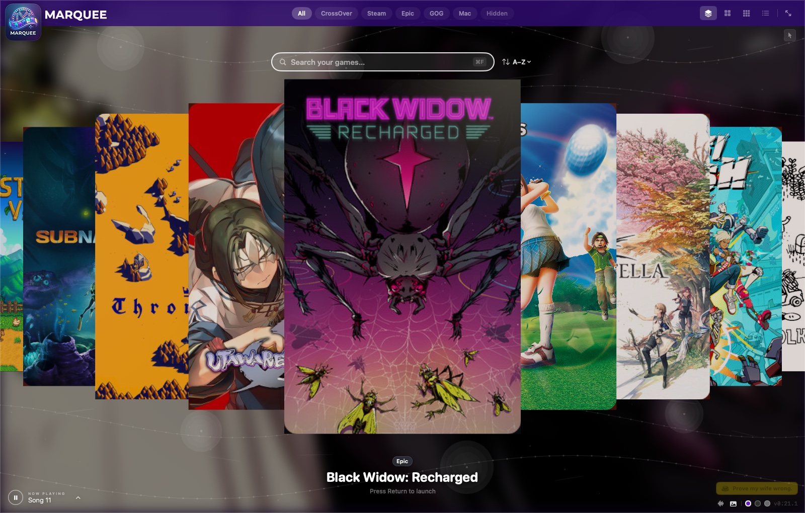

<p align="center">
  
</p>

<h1 align="center">Marquee</h1>

<p align="center"><strong>All your Mac games on one shelf.</strong><br>
A console-style game launcher for macOS that finds every game you own — CrossOver, Steam, Epic, GOG, and the Mac App Store — and puts them in one beautiful, couch-friendly library.</p>



## Why

Games on a Mac end up scattered across half a dozen launchers: native titles in `/Applications`, Steam's library, Epic's launcher, GOG installs, and Windows games running through CrossOver — some of those installed through a *Windows* copy of Steam living inside a bottle. Marquee scans all of it automatically and gives you one place to browse, search, and play.

## Features

- **A real 3D carousel** — WiiFlow-inspired cover flow built on SceneKit, with springy motion, entrance animations, and a selection ring. Grid, Wall, and List views included when you're in a browsing mood.
- **Every store, found automatically** — CrossOver bottles (Start Menu shortcuts, `cxmenu.conf`, bottled-Steam `.acf` manifests, and bare game folders), native Steam, Epic, GOG, and Mac App Store games with a games category. Storefront clients themselves are filtered out so "Steam" never shows up as a game.
- **Launches games the right way** — Steam games via `steam://`, Epic via its launcher URL, CrossOver games through CrossOver's own wine environment, and bottled-Steam titles through the bottled Steam client itself (so DRM, overlay, and cloud saves work).
- **Gets out of the way** — press PLAY and Marquee fades its music, minimizes to the Dock, and watches the game's process. When you quit the game, Marquee restores itself and fades the music back in. Idle CPU while hidden is aggressively minimized.
- **Real playtime tracking** — sessions are timed from the moment the game's process is confirmed running to the moment it exits. Play counts, last played, and total playtime feed the sort menu and the detail page.
- **Cover art that looks right** — art from Steam's public listings, [SteamGridDB](https://www.steamgriddb.com) (free API key), or your own image files. Wrong cover? Right-click → *Fix Cover Art…* and pick the correct one, per game.
- **Keyboard, mouse, and controller** — every part of the UI is reachable from all three. WASD works. A game controller's sticks, buttons, and shoulders navigate everything.
- **Live search and smart sorting** — type anywhere to search (fuzzy matching included); sort by name, platform, playtime, most/last played, or date installed.
- **The details page** — screenshots, a trailer with eShop-style playback controls, file size, install location, and metadata pulled from Steam's public store data.
- **Background music with a visualizer** — a bundled soundtrack player with an FFT visualizer, per-track shuffle weights, and volume that ducks for trailers and game sessions.
- **Favorites, hiding, themes** — pin favorites to the front, hide the clutter, and pick your backdrop.
- **A console-style pause menu** — press Esc (or a controller's Menu button, or the gear in the nav bar) for a PlayStation-style overlay with every setting and action in the app: view, filter, sort, full screen, themes, volume, refresh, quit. The menu bar is never required — full screen with only a controller in hand is a first-class way to live.
- **Couch mode** — flip on *Launch at Login* and *Start in Full Screen* (in the pause menu or Settings) and a Mac mini under the TV boots straight into your library like a console.
- **Works offline** — no internet? Cached art still shows, your library is fully browsable, and installed games launch. Marquee quietly marks itself OFFLINE, skips the network instead of hanging on it, and fills in missing art automatically the moment you're back online.

| | | |
|---|---|---|
|  |  |  |
|  |  |  |

## Getting started

**Requirements:** macOS 14 or later. A Swift toolchain (Swift 5.9+) to build — no Xcode project needed.

```bash
git clone https://github.com/jackharvest/Marquee.git
cd Marquee
make run     # builds Marquee.app and opens it
```

Other targets: `make app` (build only), `make clean`.

On first launch, Marquee walks you through a short setup: what it is, exactly what it touches on your system, and how you'd like cover art to be found. Everything is changeable later in **Settings (⌘,)** — including granular reset buttons if you ever want to re-run the welcome flow or start fresh.

**Downloaded a pre-built `Marquee.app` instead of building it?** macOS quarantines apps from the internet that aren't notarized through Apple, so the first open may say the app "is damaged" or "can't be checked for malicious software." Either **right-click → Open → Open** (once; normal double-click works forever after), or clear the quarantine flag yourself:

```bash
xattr -cr /path/to/Marquee.app
```

Building from source (above) never hits this.

## Couch mode: a Mac mini as a game console

Marquee is built to run keyboard-free on a Mac plugged into a TV:

1. **Pair a controller** — System Settings → Bluetooth. Xbox, PlayStation, and MFi controllers all work; the sticks, d-pad, face buttons, and shoulders drive the whole UI.
2. In Marquee, open the **pause menu** (controller **Menu/Start** button, or Esc) and flip on **Start in Full Screen** and **Launch at Login**.
3. **Let the Mac log itself in** — System Settings → Users & Groups → *Automatically log in as…*. (macOS disables this option while FileVault is on.)
4. That's it. Power on the Mac and it lands in your fullscreen library; every setting stays reachable from the pause menu, and PLAY gets out of the way while a game runs.

## Playing on a TV or Apple TV

The Mac renders the games, so the goal is getting the Mac's picture onto the TV:

- **HDMI (best)** — plug the Mac into the TV, set the TV as the display, done. Lowest latency, full quality; this is the couch-mode setup above.
- **Apple TV as a second display** — Control Center → Screen Mirroring → your Apple TV → *Use As Separate Display*. Then in Marquee's pause menu use **Move to Next Display** and **Full Screen** to send the library to the TV. Set the TV as the sound output in System Settings → Sound. Note that AirPlay adds real latency — great for slower games, rough for anything twitchy.
- **Apple TV mirroring** — the same Screen Mirroring menu, but mirroring the whole screen. Use this when the *game* needs to be on the TV too: games are separate apps, so mirroring just Marquee's window would leave the game behind on the Mac. Mirror the full display and everything follows.

A note on expectations: macOS can only AirPlay a *display* (mirrored or extended), not "cast" an individual app the way a video player casts a movie — so full-screen mirroring, an extended display, or a cable are the three real options.

## Where games come from

| Source | How it's detected |
|---|---|
| **CrossOver** | Bottles in `~/Library/Application Support/CrossOver/Bottles` — Start Menu `.lnk` shortcuts, `cxmenu.conf` entries, a Windows Steam client installed *inside* a bottle (its `steamapps/*.acf` manifests), and a `drive_c/GAMES` folder fallback for games with no shortcut at all |
| **Steam** (native) | `~/Library/Application Support/Steam/steamapps/*.acf` |
| **Epic** | Install manifests in `/Users/Shared/Epic Games/…` and the Epic Games Launcher's manifest folder |
| **GOG** | `.app` bundles carrying GOG's `goggame-{id}.info` marker |
| **Mac App Store / native** | `/Applications` apps whose `LSApplicationCategoryType` is a games category |

## Privacy

Marquee is private by design, and the first-launch flow spells this out before asking anything of you:

- **Reads your game libraries** — the folders above, read-only, to find installed games.
- **Writes only its own files** — cover art cache and settings live in your user Library folder. Marquee never modifies games or other apps.
- **Goes online only for cover art** — Steam's public listings or SteamGridDB, your choice. No account required, no analytics, no tracking, ever.
- **No macOS permissions required** — Marquee never prompts for privacy access. If macOS ever mentions app changes when a CrossOver game launches, that's CrossOver tidying its own generated shortcuts (Marquee launches wine with its responsibility disclaimed so the OS attributes that housekeeping correctly — and denying it is harmless either way).

## Support

If Marquee makes your Mac gaming life nicer, you can [buy me a coffee](https://www.buymeacoffee.com/jackharvest) ☕ — and prove my wife wrong.

## License

[MIT](LICENSE)
