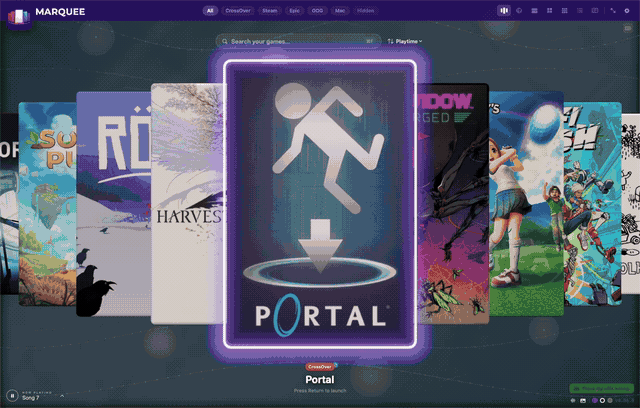
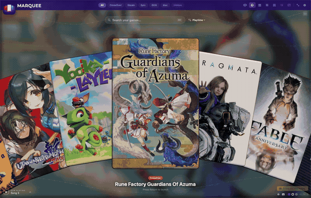
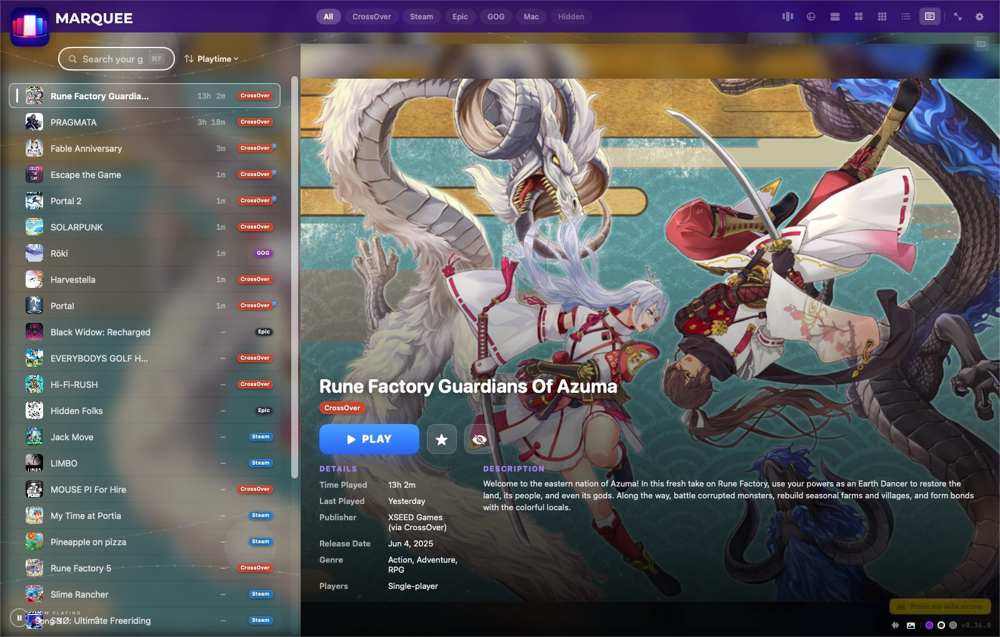
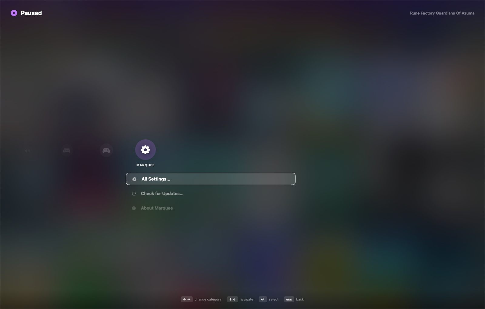

<p align="center">
  
</p>

<h1 align="center">Marquee</h1>

This fork adds native PlayCover integration. Installed iOS games appear under a PlayCover
source filter and launch from their PlayCover app bundles. Details and screenshots come
from Apple's catalog by exact bundle identifier, or from an exact-title Steam match when
the app is absent there. The installed app icon is the final cover fallback. Updates are
checked against this fork's releases so upstream builds cannot replace the integration.
The IPA Store window browses the public iPASTORE and CyPwn catalogs, groups exact bundle-ID
matches into one card, and keeps each source and build selectable. Downloads are saved in
Marquee's application-support folder and can be handed to PlayCover for import. Apple's public
lookup data supplies game subgenres and classifies CyPwn titles only when the bundle ID matches
exactly; unmatched CyPwn titles remain Unsorted. Saved IPAs can be moved to Trash in the store.
Installed apps are identified from PlayCover's library and uninstalled through PlayCover.

<p align="center"><strong>All your Mac games on one shelf.</strong><br>
A console-style game launcher for macOS that finds every game you own — CrossOver, Steam, Epic, GOG, and the Mac App Store — and puts them in one beautiful, couch-friendly library.</p>


<p align="center"><a href="https://jackharvest.com/Marquee">jackharvest.com/Marquee</a></p>

## Why

Games on a Mac end up scattered across half a dozen launchers: native titles, Steam, Epic, GOG, and
Windows games running through CrossOver. Marquee scans all of it automatically into one shelf you
browse, search, and play from — no manual list-building, ever.

**→ Full feature tour, more screenshots, and the download: [jackharvest.com/Marquee](https://jackharvest.com/Marquee)**

|  |  |
|---|---|
|  |  |
| *The carousel — real spring physics, not a slideshow* | *Rainbow Slide — a Wii Menu-style wheel of covers* |

## Highlights

- **Seven view modes** — Carousel, Rainbow Slide, Big, Grid, Wall, List, Compact List — ⌘1–7
- **Every store, found automatically** — CrossOver, Steam, Epic, GOG, Mac App Store, no manual entry
- **IPA Store** — search and filter iOS games and apps, compare source variants, and send downloaded IPAs to PlayCover
- **Bring your own library** — drag any app or exe onto the window (Plex, emulators, anything) and remove it just as easily
- **A console-style pause menu** — every setting, zero menu bar, controller-first
- **Boots like a console** — Launch at Login + Start in Full Screen, couch-ready
- **Updates itself** — checks its own GitHub releases and installs in place, no terminal required
- **Real playtime tracking, smart sort, live search, cover art that looks right, an ambient music player** — the small stuff, done

| | | |
|---|---|---|
|  |  |  |
|  |  |  |

## Getting started

Mac only, Apple Silicon — Marquee exists to fill the hole [Playnite](https://playnite.link) leaves on
the Mac. Build this fork from source:

```bash
git clone https://github.com/Sai-Hakuto/Marquee.git
cd Marquee
make run     # builds Marquee.app and opens it
```

Requires macOS 14+; building needs a Swift 5.9+ toolchain (no Xcode project). First launch walks you
through a short setup — everything's changeable later in Settings (⌘,).

Gatekeeper may flag a downloaded (not self-built) copy as unnotarized — right-click → Open → Open once,
and it launches normally forever after. After that first launch, Marquee checks for and installs its
own updates, so you shouldn't need to come back here again.

## Couch mode

Pair a controller, flip on **Start in Full Screen** + **Launch at Login** in the pause menu, and set
the Mac to auto-login — power it on and it lands straight in your fullscreen library, no keyboard
needed. Full HDMI/AirPlay setup notes are on the [website](https://jackharvest.com/Marquee).

## Where games come from

CrossOver bottles, native Steam, Epic, GOG, and Mac App Store games — each detected its own way (Start
Menu shortcuts, `.acf` manifests, bundle markers). Details on the [website](https://jackharvest.com/Marquee/features.html).

## Privacy

Marquee is private by design, and the first-launch flow spells this out before asking anything of you:

- **Reads your game libraries** — the folders above, read-only, to find installed games.
- **Writes only its own files** — cover art cache, settings, and IPA downloads live in your user Library folder. Marquee does not alter other apps or IPA contents.
- **Goes online for art and IPA catalogs** — the IPA Store fetches public iPASTORE and CyPwn catalogs and caches exact bundle-ID genre lookups from Apple. IPA downloads start only when selected. No account or analytics are built into Marquee.
- **No macOS permissions required** — Marquee never prompts for privacy access. If macOS ever mentions app changes when a CrossOver game launches, that's CrossOver tidying its own generated shortcuts (Marquee launches wine with its responsibility disclaimed so the OS attributes that housekeeping correctly — and denying it is harmless either way).

## Support

If Marquee makes your Mac gaming life nicer, you can [buy me a coffee](https://www.buymeacoffee.com/jackharvest) ☕ — and prove my wife wrong.

## License

[MIT](LICENSE)
